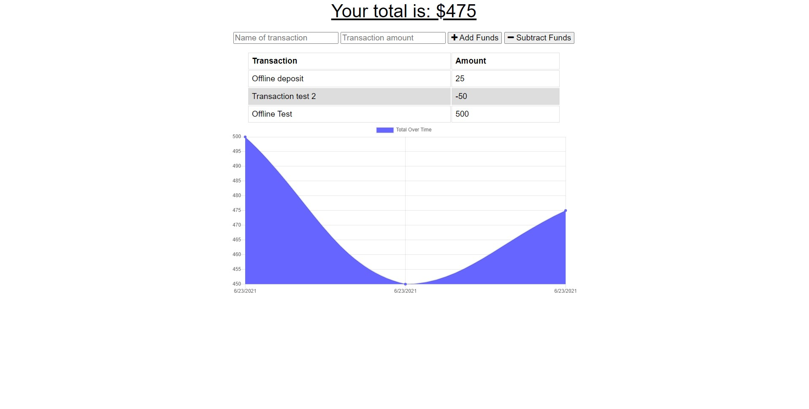

# Budget Tracker  
  

# Screenshot

# Description
Budget Tracker is a single-page PWA that allows users to track their expenses on the go, regardless of internet connection. 

# Table of Contents

* [Technology](#technology)  
* [Features](#features)  
* [Installation](#installation)   
* [Questions](#questions)  
* [License](#license)

# Technology 
| Technology | Description                        |Links ↘️ |
| ---------- | -----------------------------------| ------|  
|  | Javascript |  |
|  | HyperText Markup Language |  |
|  | Cascading Style Sheets |  |

# Features
This app features Node Js, Express, MongoDB/Mongoose and the use of client side caching for offline functionality.

# Installation  
Project Website: [Budget Tracker](https://thawing-savannah-19799.herokuapp.com/) 
* Follow these instructions to install a PWA for your specific smartphone OS:

* iOs:

  1. Navigate to [https://thawing-savannah-19799.herokuapp.com/](https://thawing-savannah-19799.herokuapp.com/) with Safari.

  2. Tap the Share button in Safari.

  3. Tap the icon labeled Add to Home Screen.

  4. Name your PWA, then tap Add in the upper-right corner.

  5. Check your Home Screen to see the app.

* Android:

  1. Navigate to [https://thawing-savannah-19799.herokuapp.com/](https://thawing-savannah-19799.herokuapp.com/) with Chrome.

  2. Tap the menu button in the upper right corner of Chrome.

  3. Tap the icon labeled Add to Home Screen.

  4. Name your PWA, then tap Add below the prompt.

  5. If there is an additional prompt asking "Add to Home screen?", tap Add.

  6. Check your Home Screen to see the app.

* If you currently do not have access to a smart phone, do the following on your computer:
## CHROME

  1. Navigate to [https://thawing-savannah-19799.herokuapp.com/](https://thawing-savannah-19799.herokuapp.com/) with Chrome.

  2. Open the Settings in Chrome.
  
  3. Click on Install Budget Tracker...

  4. At the prompt "Install app?", click Install.

  5. A new Chrome window opens with your application running in it. It is now installed as a desktop app!

 ## EDGE

  1. Navigate to [https://thawing-savannah-19799.herokuapp.com/](https://thawing-savannah-19799.herokuapp.com/) with Edge.

  2. Open the Settings in Edge.

  3. Click on Apps
  
  4. Click on Install Budget Tracker...

  5. At the prompt "Install app?", click Install.

  6. A new Edge window opens with your application running in it. It is now installed as a desktop app!

# Questions
Feel free to reach out if you have any questions

Contact via GitHub: [iiTONELOC](https://github.com/iiTONELOC)  
Send an email: 

# License
MIT License

        Copyright (c) 2021 Anthony Tropeano
        
        Permission is hereby granted, free of charge, to any person obtaining a copy
        of this software and associated documentation files (the "Software"), to deal
        in the Software without restriction, including without limitation the rights
        to use, copy, modify, merge, publish, distribute, sublicense, and/or sell
        copies of the Software, and to permit persons to whom the Software is
        furnished to do so, subject to the following conditions:
        
        The above copyright notice and this permission notice shall be included in all
        copies or substantial portions of the Software.
        
        THE SOFTWARE IS PROVIDED "AS IS", WITHOUT WARRANTY OF ANY KIND, EXPRESS OR
        IMPLIED, INCLUDING BUT NOT LIMITED TO THE WARRANTIES OF MERCHANTABILITY,
        FITNESS FOR A PARTICULAR PURPOSE AND NONINFRINGEMENT. IN NO EVENT SHALL THE
        AUTHORS OR COPYRIGHT HOLDERS BE LIABLE FOR ANY CLAIM, DAMAGES OR OTHER
        LIABILITY, WHETHER IN AN ACTION OF CONTRACT, TORT OR OTHERWISE, ARISING FROM,
        OUT OF OR IN CONNECTION WITH THE SOFTWARE OR THE USE OR OTHER DEALINGS IN THE
        SOFTWARE.
        
